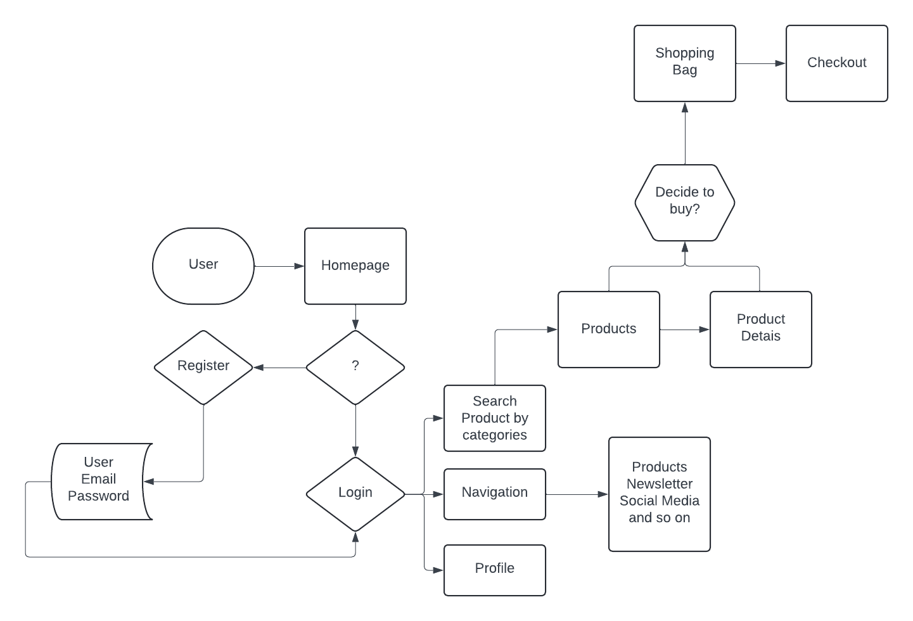
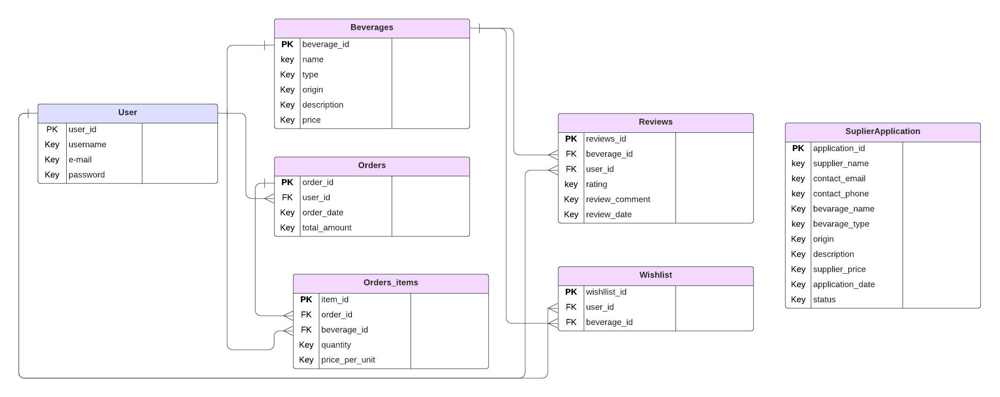

# Planning Phase

Beverage Bazaar is an online marketplace dedicated to aficionados and enthusiasts seeking the finest selection of beverages from around the world. Our platform offers a curated collection of premium wines, exquisite whiskeys, luxurious champagnes, delightful sparkling wines and craft beers.
At Beverage Bazaar, we understand the passion and discerning taste of our customers, which is why we strive to provide a diverse range of offerings to cater to every palate and occasion. Whether you're searching for a rare vintage wine to complement a special celebration, a smooth and sophisticated whiskey for indulgent moments, or a refreshing artisanal beer for casual enjoyment, our platform is your ultimate destination.
Detailed product descriptions, including origin, tasting notes, and expert recommendations, empower customers to make informed choices and elevate their drinking experience.
Beyond offering an unparalleled selection of fine beverages, Beverage Bazaar is committed to providing exceptional customer service and a hassle-free shopping experience. Our secure payment processing and efficient delivery options ensure that your chosen beverages are delivered to your doorstep with care and convenience.

### Brand Identity:

## Scope

Beverage Bazaar aims to create a user-friendly online marketplace for enthusiasts to explore and purchase a wide range of fine beverages. The scope of the project encompasses the development of essential features to ensure the platform's functionality and ease of use:

### Feature Prioritization

1.	User Registration and Authentication:
    - Users will be able to create accounts, providing basic information such as name, email, and password.
    - Authentication mechanisms will ensure secure access to user accounts.

2.	Beverage Browsing:
    - User-friendly interface for browsing a wide selection of fine beverages, categorized by type (wine, whiskey, champagne, beer, etc.).
    - Detailed product listings with images, descriptions, origin, tasting notes, and pricing.
    - Advanced search and filtering options to help users find specific beverages based on criteria such as type, region, price range, and ratings.

3.	Ordering:
    - Checkout process allowing users to add selected beverages to their cart and proceed to checkout.
    - Option for users to specify delivery preferences, including shipping address.
    - Order confirmation emails with detailed summaries of purchased items and delivery information.

4.	Payment Processing:
    - Secure payment processing system supporting  payment methods, including credit and debit cards.
    - Integration with a reliable payment service provider to ensure transactions are processed securely and efficiently.

5.	User Management:
    - User authentication system allowing users to create accounts, log in, and securely access their profiles.
    - Profile management functionalities enabling users to update personal information, manage saved addresses, and view order history.
    - Account settings for preferences such as email notifications and communication preferences.

6.	Product Reviews and Ratings:
    - Feature allowing users to leave reviews and ratings for purchased beverages, sharing their experiences and recommendations with other users.

7.	Admin Panel:
    - Admin dashboard for content moderation and management, enabling administrators to monitor user activity, manage product listings, and oversee order processing.
    - Tools for adding, editing, and removing beverages from the catalogue, as well as managing user accounts and resolving disputes.

8.	Newsletter Subscription
    - Users can opt-in to receive weekly newsletters featuring product recommendations, promotions, and other updates.
    - Newsletter content includes curated beverage selections, exclusive offers, and industry news to engage and inform subscribers.

9.	Supplier Application Process
    - Suppliers interested in listing their products in the online store can request inclusion by submitting an application.
    - The application process includes providing details about the products, such as descriptions and pricing.

10.	Responsive Design
    - Responsive and mobile-friendly design ensuring a seamless browsing and purchasing experience across devices, including smartphones, tablets, and desktop computers.

By implementing these features and functionalities, Beverage Bazaar will provide users with a comprehensive and convenient online platform for exploring, purchasing, and enjoying a diverse range of fine beverages.

## Structure
The structure of Beverage Bazaar's platform is designed to provide a seamless and intuitive user experience, ensuring easy access to key features such as browsing beverages, managing user accounts, placing orders, sign up for newsletter and writing reviews.

## User Stories

1. **As an Admin...**

    - As an Admin, I can access a user-friendly admin panel to manage beverage listings, user accounts, and platform settings efficiently.
    - As an Admin, I can easily add, edit, and delete beverage listings from the admin dashboard to ensure the accuracy and relevance of the product catalog.
    - As an Admin, I can review requests from suppliers to include their products in the Beverage Bazaar platform.
    - As an Admin, I can approve or reject supplier requests for product inclusion based on quality standards and platform guidelines.
    - As an Admin, I can monitor user activity and manage user accounts, including the ability to suspend or delete accounts if necessary.
    - As an Admin, I can receive notifications for important events such as new beverage listings, user registrations, and orders to stay informed and take timely actions.

2. **As a Supplier...**
    - As a Supplier, I can create an account on Beverage Bazaar to showcase my fine beverages to a wider audience.
    - As a Supplier, I can request inclusion of my products in the Beverage Bazaar platform by submitting a form with product details for review by the admin.
    - As a Supplier, I can receive notifications for the status of my product inclusion requests, enabling me to stay informed about the review process.

3. **As a Customer...**
    - As a Customer, I can create an account on Beverage Bazaar to explore and purchase a variety of fine beverages.
    - As a Customer, I can browse through different beverage categories, such as wines, whiskeys, champagnes, beers, etc., to discover new products.
    - As a Customer, I can search for specific beverages based on criteria like type, origin, price range, and ratings to find products that suit my preferences.
    - As a Customer, I can view detailed product listings, including descriptions, origin, tasting notes, and pricing, to make informed purchasing decisions.
    - As a Customer, I can read product reviews and ratings from other users to help me make informed purchasing decisions.
    - As a Customer, I can save favorite beverages to a wishlist for easy access and future purchase consideration.

4. **As a Newsletter Subscriber...**
    - As a Newsletter Subscriber, I can opt-in to receive weekly newsletters from Beverage Bazaar featuring product recommendations, promotions, and industry news.
    - As a Newsletter Subscriber, I can stay updated with the latest offerings and trends in the world of fine beverages by reading the newsletter content delivered to my inbox regularly.
    - As a Newsletter Subscriber, I can easily unsubscribe or opt-out from receiving newsletters from Beverage Bazaar if I no longer wish to receive them.
    - As a Newsletter Subscriber, I can find a clear and easily accessible option to unsubscribe or manage my newsletter preferences within the newsletter email or on the Beverage Bazaar website.

## Skeleton

### Wireframe

**Wireframes:** Wireframes are created for each page of the platform, depicting the layout of elements such as navigation bar, search filters, products, products details and shopping bag.

[Homepage - large devices](docs/images/homepage.png)

[Homepage - medium devices](docs/images/homapage_ipad.png)

[Homepage - small devices](docs/images/homepage_mobile.png)

[Products - large devices](docs/images/products.png)

[Products - medium devices](docs/images/products_ipad.png)

[Products - small devices](docs/images/products_mobile.png)

[Products Details - large devices](docs/images/products_details.png)

[Products Details - medium devices](docs/images/products_details_ipad.png)

[Products Details - small devices](docs/images/products_details_mobile.png)

[Shopping Bag - large devices](docs/images/bag.png)

[Shopping Bag - medium devices](docs/images/bag_ipad.png)

[Shopping Bag - small devices](docs/images/bag_mobile.png)

### Colour Scheme

### Typography

### Database Schema

This diagram depicts the relationship between several tables: Users, Beverages, Orders, Order_Items, Reviews, and Wishlist. Each table is designed to store essential information for the Beverage Bazaar platform.

- The Users table stores user data, including account information and authentication details.
- The Beverages table contains details about the available beverages, such as name, type, origin, description, and price.
- The Orders table records information about user orders, linking each order to a specific user.
- The Order_Items table breaks down orders into individual items, associating each item with a specific order and beverage.
- The Reviews table stores user reviews and ratings for beverages, linking each review to both the user who wrote it and the beverage being reviewed.
- The Wishlist table keeps track of beverages that users have marked as favorites, linking each entry to the relevant user and beverage.

Foreign key relationships are used to establish connections between these tables, ensuring data integrity.

Below is the preliminary layout for the database tables:

