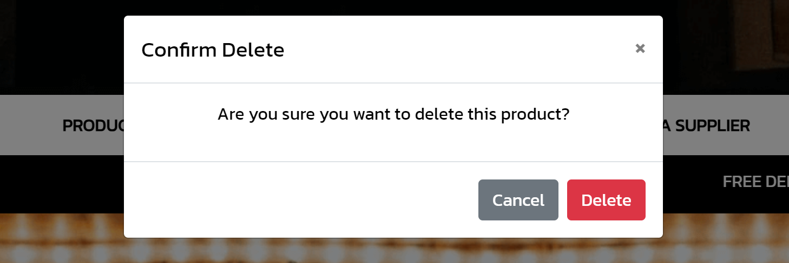

# Planning Phase

Beverage Bazaar is an online marketplace dedicated to aficionados and enthusiasts seeking the finest selection of beverages from around the world. Our platform offers a curated collection of premium wines, exquisite whiskeys, luxurious champagnes, delightful sparkling wines and craft beers.
At Beverage Bazaar, we understand the passion and discerning taste of our customers, which is why we strive to provide a diverse range of offerings to cater to every palate and occasion. Whether you're searching for a rare vintage wine to complement a special celebration, a smooth and sophisticated whiskey for indulgent moments, or a refreshing artisanal beer for casual enjoyment, our platform is your ultimate destination.
Detailed product descriptions, including origin, tasting notes, and expert recommendations, empower customers to make informed choices and elevate their drinking experience.
Beyond offering an unparalleled selection of fine beverages, Beverage Bazaar is committed to providing exceptional customer service and a hassle-free shopping experience. Our secure payment processing and efficient delivery options ensure that your chosen beverages are delivered to your doorstep with care and convenience.

### Brand Identity:

## Scope

Beverage Bazaar aims to create a user-friendly online marketplace for enthusiasts to explore and purchase a wide range of fine beverages. The scope of the project encompasses the development of essential features to ensure the platform's functionality and ease of use:

### Feature Prioritization

1.	User Registration and Authentication:
    - Users will be able to create accounts, providing basic information such as name, email, and password.
    - Authentication mechanisms will ensure secure access to user accounts.

2.	Beverage Browsing:
    - User-friendly interface for browsing a wide selection of fine beverages, categorized by type (wine, whiskey, champagne, beer, etc.).
    - Detailed product listings with images, descriptions, origin, tasting notes, and pricing.
    - Advanced search and filtering options to help users find specific beverages based on criteria such as type, region, price range, and ratings.

3.	Ordering:
    - Checkout process allowing users to add selected beverages to their cart and proceed to checkout.
    - Option for users to specify delivery preferences, including shipping address.
    - Order confirmation emails with detailed summaries of purchased items and delivery information.

4.	Payment Processing:
    - Secure payment processing system supporting  payment methods, including credit and debit cards.
    - Integration with a reliable payment service provider to ensure transactions are processed securely and efficiently.

5.	User Management:
    - User authentication system allowing users to create accounts, log in, and securely access their profiles.
    - Profile management functionalities enabling users to update personal information, manage saved addresses, and view order history.
    - Account settings for preferences such as email notifications and communication preferences.

6.	Product Reviews and Ratings:
    - Feature allowing users to leave reviews and ratings for purchased beverages, sharing their experiences and recommendations with other users.

7.	Admin Panel:
    - Admin dashboard for content moderation and management, enabling administrators to monitor user activity, manage product listings, and oversee order processing.
    - Tools for adding, editing, and removing beverages from the catalogue, as well as managing user accounts and resolving disputes.

8.	Newsletter Subscription
    - Users can opt-in to receive weekly newsletters featuring product recommendations, promotions, and other updates.
    - Newsletter content includes curated beverage selections, exclusive offers, and industry news to engage and inform subscribers.

9.	Supplier Application Process
    - Suppliers interested in listing their products in the online store can request inclusion by submitting an application.
    - The application process includes providing details about the products, such as descriptions and pricing.

10.	Responsive Design
    - Responsive and mobile-friendly design ensuring a seamless browsing and purchasing experience across devices, including smartphones, tablets, and desktop computers.

By implementing these features and functionalities, Beverage Bazaar will provide users with a comprehensive and convenient online platform for exploring, purchasing, and enjoying a diverse range of fine beverages.

## Structure
The structure of Beverage Bazaar's platform is designed to provide a seamless and intuitive user experience, ensuring easy access to key features such as browsing beverages, managing user accounts, placing orders, sign up for newsletter and writing reviews.

## User Stories

1. **As an Admin...**

    - As an Admin, I can access a user-friendly admin panel to manage beverage listings, user accounts, and platform settings efficiently.
    - As an Admin, I can easily add, edit, and delete beverage listings from the admin dashboard to ensure the accuracy and relevance of the product catalog.
    - As an Admin, I can review requests from suppliers to include their products in the Beverage Bazaar platform.
    - As an Admin, I can approve or reject supplier requests for product inclusion based on quality standards and platform guidelines.
    - As an Admin, I can monitor user activity and manage user accounts, including the ability to suspend or delete accounts if necessary.
    - As an Admin, I can receive notifications for important events such as new beverage listings, user registrations, and orders to stay informed and take timely actions.

2. **As a Supplier...**
    - As a Supplier, I can create an account on Beverage Bazaar to showcase my fine beverages to a wider audience.
    - As a Supplier, I can request inclusion of my products in the Beverage Bazaar platform by submitting a form with product details for review by the admin.
    - As a Supplier, I can receive notifications for the status of my product inclusion requests, enabling me to stay informed about the review process.

3. **As a Customer...**
    - As a Customer, I can create an account on Beverage Bazaar to explore and purchase a variety of fine beverages.
    - As a Customer, I can browse through different beverage categories, such as wines, whiskeys, champagnes, beers, etc., to discover new products.
    - As a Customer, I can search for specific beverages based on criteria like type, origin, price range, and ratings to find products that suit my preferences.
    - As a Customer, I can view detailed product listings, including descriptions, origin, tasting notes, and pricing, to make informed purchasing decisions.
    - As a Customer, I can read product reviews and ratings from other users to help me make informed purchasing decisions.
    - As a Customer, I can save favorite beverages to a wishlist for easy access and future purchase consideration.

4. **As a Newsletter Subscriber...**
    - As a Newsletter Subscriber, I can opt-in to receive weekly newsletters from Beverage Bazaar featuring product recommendations, promotions, and industry news.
    - As a Newsletter Subscriber, I can stay updated with the latest offerings and trends in the world of fine beverages by reading the newsletter content delivered to my inbox regularly.
    - As a Newsletter Subscriber, I can easily unsubscribe or opt-out from receiving newsletters from Beverage Bazaar if I no longer wish to receive them.
    - As a Newsletter Subscriber, I can find a clear and easily accessible option to unsubscribe or manage my newsletter preferences within the newsletter email or on the Beverage Bazaar website.

## Skeleton

The structure of Beverages Bazaar's platform establishes the foundational framework through wireframes, delineating the strategic placement of essential elements and features across each page. This ensures a seamless and intuitive user journey. Key elements of the platform structure include:

**Wireframes:** Wireframes are created for each page of the platform, depicting the layout of elements such as navigation bar, search filters, products, products details and shopping bag.

[Homepage - large devices](docs/images/homepage.png)

[Homepage - medium devices](docs/images/homapage_ipad.png)

[Homepage - small devices](docs/images/homepage_mobile.png)

[Products - large devices](docs/images/products.png)

[Products - medium devices](docs/images/products_ipad.png)

[Products - small devices](docs/images/products_mobile.png)

[Products Details - large devices](docs/images/products_details.png)

[Products Details - medium devices](docs/images/products_details_ipad.png)

[Products Details - small devices](docs/images/products_details_mobile.png)

[Shopping Bag - large devices](docs/images/bag.png)

[Shopping Bag - medium devices](docs/images/bag_ipad.png)

[Shopping Bag - small devices](docs/images/bag_mobile.png)

### Colour Scheme

The chosen colors for the project development were inspired by a palette of neutral tones, including shades of gray and white. This choice was made to create a modern and sophisticated aesthetic, aligned with the visual concept of the application.

### Typography

For the Beverages Bazaar project, we employed a combination of fonts to enhance readability and aesthetic appeal.

Body Text:
The main body text utilizes the "Kanit" font family, paired with a fallback of sans-serif for compatibility across different devices and browsers.

Logo Font:
The Beverages Bazaar logo features the "Amatic SC" font, which adds a touch of informality and uniqueness to the brand identity.

### Database Schema

This diagram depicts the relationship between several tables: Users, Beverages, Orders, Order_Items, Reviews, and Wishlist. Each table is designed to store essential information for the Beverage Bazaar platform.

- The Users table stores user data, including account information and authentication details.
- The Beverages table contains details about the available beverages, such as name, type, origin, description, and price.
- The Orders table records information about user orders, linking each order to a specific user.
- The Order_Items table breaks down orders into individual items, associating each item with a specific order and beverage.
- The Reviews table stores user reviews and ratings for beverages, linking each review to both the user who wrote it and the beverage being reviewed.
- The Wishlist table keeps track of beverages that users have marked as favorites, linking each entry to the relevant user and beverage.

Foreign key relationships are used to establish connections between these tables, ensuring data integrity.

Below is the preliminary layout for the database tables:

**Agile Methodology**

The entire development process following Agile methodology can be found here [AGILE](AGILE.md). I wanted to leave a note, stating that all user stories, epics, Kanban board were verified, and a comment was added at the conclusion of each user story. It's worth noting that some user stories had more than one task. For all other completed tasks, a tick mark was placed on each of them.

## Live Website

To access the live version of the website, click [here](https://bevarages-bazaar-677df0f4b466.herokuapp.com/).

## Features:

**Homepage**:

**Navbar**:

I chose "Beverages Bazaar" because it clearly conveys the purpose of the app: providing a marketplace for beverages. The name "Beverages Bazaar" emphasizes the app's focus on offering a variety of drinks, catering to diverse tastes and preferences. The use of "Bazaar" suggests a lively and extensive marketplace, indicating to users that they can explore and discover a multitude of beverage options. This name not only highlights the central theme of beverages but also creates an inviting and dynamic impression for users seeking to explore different drink choices.

**Signed Out**
When the user is signed out, they are directed to a simplified navbar with only "Register" and "Login" options.

**Sign In**

**Register**

**Log Out**

**Modal Delete Confirmation**

**Product page**

**Product details page**

**Add Product**

**Product User/Superuser buttons**

**Wishlist page**:

**Rating**:

**Bag page**:

**Checkout page**:

**Order Details**:

**Profile page**:

**Supplier request form**:

**Footer**:

**Subscribe Newlleter**:

**Facebook Bussiness Page**:

## Technologies Used

- **HTML**: Formed the foundation language for structuring the layout of all templates.

- **CSS**: Customized CSS was applied to enhance the visual aesthetics of the page.

- **JavaScript**: Integrated JavaScript extensively to manipulate the Document Object Model (DOM) and interact with the backend for CRUD (Create, Read, Update, Delete) operations on the database.

- **Python**: We used Python in the Room Finder project for the backend development, which includes the system's logic and interaction with the database.

- **Django**: Employed as the primary Python framework for this project.

- **Django All Auth**: Implemented to manage user authentication functionalities such as sign-in, sign-up, and sign-out.

- **Django-countries**: Used to provide a country field for Django models.

- **Django-crispy-forms**: Employed to style Django forms with Bootstrap.

- **Cloudinary**: Integrated Cloudinary to manage image uploads and storage efficiently within the Room Finder project

- **Heroku**: Utilized as the deployment platform to host the project and make it accessible to the public.

- **Heroku PostgreSQL**: Served as the database solution both during development and deployment phases.

- **Stripe**: Used to handle payment processing within the application.

- **Gunicorn**: Used as the WSGI HTTP Server for deploying the project on Heroku.

## Testing

**Google's Lighthouse Performance**

- [Homepage - Desktop](docs/images/lighthouse_homepage_desktop.png)
- [Homepage - Mobile](docs/images/lighthouse_homepage_mobile.png)
- [Contact - Desktop](docs/images/lighthouse_contact_desktop.png)
- [Contact - Mobile](docs/images/lighthouse_contact_mobile.png)
- [Sign in - Desktop](docs/images/lighthouse_login_dasktop.png)
- [Sign in - Mobile](docs/images/lighthouse_login_mobile.png)
- [Register - Desktop](docs/images/lighthouse_register_dasktop.png)
- [Register - Mobile](docs/images/lighthouse_register_mobile.png)
- [Add room - Desktop](docs/images/lighthouse_addroom_dasktop.png)
- [Add room - Mobile](docs/images/lighthouse_addroom_dasktop.png)
- [Room Finder - Desktop](docs/images/lighthouse_findroom_desktop.png)
- [Room Finder - Mobile](docs/images/lighthouse_findroom_desktop.png)

**Code Validation**

**Python files** have been validated using [Python Linter](https://pep8ci.herokuapp.com/). Attached are screenshots of the validation.

-**Bag app**
- [views.py](docs/images/views.py_bag.png)

- [urls.py](docs/images/urls.py_bag.png)

-**Checkout app**
- [admin.py](docs/images/admin.py_checkout.png)

- [views.py](docs/images/views.py_chechout.png)

- [forms.py](docs/images/forms.py_checkout.png)

- [urls.py](docs/images/urls.py_checkout.png)

- [models.py](docs/images/models.py_chechout.png)

- [webhook_handler.py](docs/images/webhookler_handler_checkout.png)

- [signals.py](docs/images/singnals.py_chechout.png)

-**Product app**
- [admin.py](docs/images/admin.py_product.png)

- [forms.py](docs/images/forms.py_product.png)

- [urls.py](docs/images/urls.py_product.png)

- [views.py](docs/images/views.py_product.png)

- [models.py](docs/images/models.py_product.png)

-**Profile app**

- [forms.py](docs/images/forms.py_profile.png)

- [urls.py](docs/images/urls.py_profile.png)

- [views.py](docs/images/views.py_profile.png)

- [models.py](docs/images/models.py_profile.png)

-**Review app**

- [urls.py](docs/images/urls.py_review.png)

- [views.py](docs/images/views.py_review.png)

- [models.py](docs/images/models.py_review.png)

- [forms.py](docs/images/forms.py_review.png)

-**Supplier app**

- [forms.py](docs/images/forms.py_supplier.png)

- [urls.py](docs/images/urls.py_supplier.png)

- [views.py](docs/images/views.py_supplier.png)

- [models.py](docs/images/models.py_supplier.png)

-**Wishlist app**

- [forms.py](docs/images/forms.py_wishlist.png)

- [urls.py](docs/images/urls.py_wishlist.png)

- [views.py](ddocs/images/views.py_wishlist.png)

- [models.py](docs/images/models.py_wishlist.png)

**CSS file** has been validated through [W3C](https://jigsaw.w3.org/css-validator/).

- [base.css](docs/images/css_validation.png)

**Justification for Not Implementing HTML Validation**

HTML validation was not performed due to several indications of errors encountered during the development process. Unfortunately, due to time constraints, I was unable to identify and resolve all issues promptly. Additionally, since the project extensively utilizes Bootstrap, certain errors may not have been readily identifiable within my codebase.

Given the prioritization of project completion within the deadline, addressing HTML validation issues comprehensively was challenging. Future iterations will include a thorough validation process to ensure compliance with HTML standards and to enhance overall code quality.

**Responsiveness**

Special attention is given to ensuring that the platform is responsive across various devices and screen sizes. The wireframes are optimized to adapt seamlessly to laptops, tablets, and smartphones, providing a consistent user experience across all devices.

- [Homepage - large](docs/images/home_page_lg_device.png)
- [Homepage - medium](docs/images/home_page_md_device.png)
- [Homepage - small](docs/images/home_page_sm_device.png)
- [Product Page - Large](docs/images/product_page_lg_device.png)
- [Product Page - Medium](docs/images/product_page_md_device.png)
- [Product Page - small](docs/images/product_page_sm_device.png)
- [Add product Page - large](docs/images/add_product_lg_device.png)
- [Add product Page - medium](docs/images/add_product_md_device.png)
- [Add product Page - small](docs/images/add_product_sm_device.png)
- [Product Detail - large](docs/images/product_detail_lg_device.png)
- [Product Detail - medium](docs/images/product_detail_md_device.png)
- [Product Detail - small](docs/images/product_detail_sm_device.png)
- [Bag page - large](docs/images/bag_lg_device.png)
- [Bag page - medium](docs/images/bag_md_device.png)
- [Bag page - small](docs/images/bag_sm_device.png)
- [Checkout page - large](docs/images/checkout_lg_device.png)
- [Checkout page - medium](docs/images/checkout_md_device.png)
- [Checkout page - small](docs/images/checkout_sm_device.png)
- [Profile page - large](docs/images/profile_lg_device.png)
- [Profile page - medium](docs/images/profile_md_device.png)
- [Profile page - small](docs/images/product_page_sm_device.png)
- [Wishlist page - large](docs/images/wishlis_lg_device.png)
- [Wishlist page - medium](docs/images/wishlist_md_device.png)
- [Wishlist page - small](docs/images/wishlis_sm_device.png)
- [Become a supplier page - large](docs/images/become_supplier_lg_device.png)
- [Become a supplier page - medium](docs/images/become_supplier_md_device.png)
- [Become a supplier page - small](docs/images/become_supplier_sm_device.png)

## Manual Test

*Note: "?" - Will be implemented in the future*

**As an Admin I can ....**

| Status  | Feature |                                                                           
|:-------:|:--------|
| &check; | utilize the admin panel to create, update and delete beverage listings |       
| &check; | easily navigate the admin panel, view, search, add, and delete beverage listings |
| &check; | utilize a text editor within the admin panel |
|    ?    | filter and search all beverage listings from the admin page |
|    ?    | receive notifications when a beverage is sold |

**As a User Looking to Buy Beverages ....**

| Status  | Feature |                                                                           
|:-------:|:--------|
| &check; | browse various beverage listings with ease |       
| &check; | filter beverage listings by category, price, and ratings |
| &check; | search for specific beverages using keywords |
| &check; | view detailed information and images for each beverage |
| &check; | add beverages to my cart for purchase |
| &check; | proceed to checkout and complete the purchase process |
| &check; | create and manage a user account |
| &check; | save favorite beverages to a wishlist |
| &check; | view my order history and track current orders |

**As an Interested Supplier Looking to Become a Supplier ....**

| Status  | Feature |                                                                           
|:-------:|:--------|    
| &check; | complete a detailed supplier application form |
| &check; | upload necessary informations |
| &check; | receive confirmation of application submission |
|    ?    | track the status of my supplier application |
|    ?    | receive notifications about the approval process |
|    ?    | access and manage my supplier profile upon approval |
|    ?    | list beverages for sale on the platform |
|    ?    | update and manage my beverage

## Manual Testing features

**HomePage**:

| Status  | Feature |
| &check; | Homepage|                                                                             
|:-------:|:--------|
| &check; | Easy Navigation on the Navbar Links |       
| &check; | Visual Information, such as clear |
| &check; | Easy Identification of the Searched Content on the Page |
| &check; | Informative Indication of User Authentication Status |

**Register**:

| Status  | Feature |
|:-------:|:--------|                                                                            
| &check; | User registration form |  
| &check; | Input validation for all required fields |       
| &check; | Email confirmation upon successful registration |
| &check; | Error messages for incorrect or missing field entries |
| &check; | Account activation after email confirmation |
| &check; | Access granted upon successful email confirmation and registration completion |

**Add product**:

| Status  |   Feature   |
| &check; | Add product |
|:-------:|:--------|                                                                             
| &check; | Simple and descriptive form |       
| &check; | Icons associated with each input |
| &check; | Ability to upload photos |
| &check; | Error messages for incorrect field entries |
| &check; | An informative button for form submission |
| &check; | Receive a message confirming that my form has been submitted after sending it |

**Become a Supplier**:

| Status  | Feature           |
| &check; | Become a supplier |   
|:-------:|:--------|                                                                          
| &check; | Simple and descriptive registration form |       
| &check; | Upload necessary informations|
| &check; | Error messages for incorrect field entries |
| &check; | Receive confirmation of application submission |

**Wishlist**:

| Status  | Feature        |   
| &check; | Add to wishlist|      
|:-------:|:--------|                                                                       
| &check; | View wishlist items |       
| &check; | Remove items from wishlist |
| &check; | Notifications for successful addition/removal of items |

**Checkout**:

| Status  | Feature          |
| &check; | Checkout process |  
|:-------:|:--------|                                                                            
| &check; | Simple and clear checkout form |       
| &check; | make a payment |
| &check; | Error messages for incorrect field entries |
| &check; | Order summary before final submission |
| &check; | Receive confirmation of successful order placement |

**Delete**:

| Status  | Feature                   |
| &check; | Delete product or listing |    
|:-------:|:--------|                                                                           
| &check; | Confirm deletion with a prompt |       
| &check; | Notification for successful deletion |
| &check; | Modal confimation before delete |
| &check; | Update user interface to reflect deletion immediately |

**Search Filter**:

| Status  | Feature                     |
| &check; | Search filter functionality | 
|:-------:|:--------|                                                                          
| &check; | Simple and intuitive search bar |       
| &check; | Ability to filter results by category, price, and rating |
| &check; | Dynamic updating of search results based on filters applied |
| &check; | Clear error messages for invalid search queries |
| &check; | Notification if no products match the search criteria |

**Rating Product**:

| Status  | Feature        |
| &check; | Rate a product |  
|:-------:|:--------|                                                                           
| &check; | Simple and clear rating interface |       
| &check; | Ability to select rating from 1 to 5 stars |
| &check; | Confirmation message after successful rating submission |
| &check; | Display of average rating |

**Subscribe to newletter**:

| Status  | Feature                               |
| &check; | Subscribe to newsletter functionality |   
|:-------:|:--------|                                                                           
| &check; | Simple and clear subscription form |       
| &check; | Input field for email address |
| &check; | Error messages for invalid email input |
| &check; | Confirmation message after successful subscription |

## Bugs

**Issue** - Encountered errors when uploading product images, with the images failing to display after the upload process.

- Cause - After investigation, it was found that the Cloudinary upload preset configured in the frontend did not match the preset specified in the backend settings, causing the upload process to fail.

- Solution - Aligning the Cloudinary upload preset settings between the frontend and backend resolved the issue, ensuring that images were uploaded successfully and displayed correctly after the upload process.

**Issue** - During deployment, images and some static files were not being uploaded properly to Heroku, resulting in discrepancies between the production and preview versions of the site.

- Cause - The issue was initially suspected to be a conflict in Cloudinary configuration. However, after further investigation with the help of support, it was discovered that an empty file named profile.css (ccc) was causing the collectstatic command to fail with an "empty folder" error.

- Solution - Deleted the profile.css file as identified by the support channel. After deletion, running python3 manage.py collectstatic successfully uploaded all static files, including images, during deployment, resolving the issue.

**Issue** - The country field in the checkout template form appears differently compared to other fields. Attempts to correct this issue were unsuccessful due to time constraints before project delivery. However, it was determined that this visual inconsistency does not affect the functionality of the checkout process.

- Cause - The specific cause of the visual disparity in the country field could not be pinpointed within the given timeframe. Further investigation is required to identify the root cause.

- Status - As of now, the issue remains unresolved but has been acknowledged as non-impacting to the checkout process. It will be prioritized for investigation and correction once authorized for further development post-deployment.

**Issue** - The webhook was failing to complete successfully due to a missing trailing slash in the URL and an additional issue with missing settings import in the `webhook_handler.py` file. These issues caused the server to not recognize the endpoint correctly and prevented the webhook from fully processing the payment confirmation. This, in turn, affected the user registration process as the confirmation email was not being sent, preventing new users from verifying their email addresses and gaining access to their accounts.

- Cause - The initial issue was identified as a missing trailing slash in the webhook URL, which is required by Django to correctly route the request to the intended view. Without the slash, Django was unable to match the URL to the appropriate view, resulting in a failure to process the webhook event.

After correcting the URL, a second issue was identified. The `webhook_handler.py` file was missing the necessary import statement: `from django.conf import settings`. This import is essential for accessing settings variables, such as email configurations, which are required during the processing of the webhook.

These combined issues not only disrupted the payment confirmation process but also caused a failure in the user registration process. Since the confirmation email was not being sent due to the webhook failure, new users were unable to confirm their email addresses, which blocked them from accessing their accounts.

- Status - Both issues have been resolved. The URL now includes the trailing slash, and the `webhook_handler.py` file has been updated to include the necessary import statement. As a result, the webhook now completes successfully, and the email confirmation process for new user registrations functions as intended. New users can now receive confirmation emails, verify their email addresses, and gain access to their accounts seamlessly.

Below are screenshots showing the issues before and after the fixes, including the entire registration process:
- **Before**: The webhook URL without the trailing slash and the missing import in `webhook_handler.py`, leading to email confirmation failures.
- **After**: The corrected webhook URL with the trailing slash, the inclusion of the necessary import in `webhook_handler.py`, and the successful execution of the registration process.

**Issue** - The application previously allowed the entry of negative values for prices and ratings in the product models and forms. This led to incorrect data being stored, which could negatively impact the user experience and result in misleading product information.

- Cause - The lack of validation checks in the product models and forms permitted negative values to be entered and saved, resulting in incorrect price and rating data being displayed on the site.

- Solution - To address this, validation logic was added both in the `Product` model and in the product forms to ensure that no negative values can be saved. Specifically:
  
- In `models.py`, the `clean` method was overridden to include checks that raise a `ValidationError` if the `price` or `rating` fields contain negative values. Additionally, the `save` method was modified to call the `clean` method before saving the product instance.

def clean(self):
    super().clean()
    if self.price is not None and self.price < 0:
        raise ValidationError('Price cannot be negative')
    if self.rating is not None and self.rating < 0:
        raise ValidationError('Rating cannot be negative')

def save(self, *args, **kwargs):
    self.clean()
    super().save(*args, **kwargs)

- In `forms.py`, custom `clean_price` and `clean_rating` methods were implemented to validate the form data before submission, ensuring that any negative values are caught and rejected.

def clean_price(self):
    price = self.cleaned_data.get('price')
    if price < 0:
        raise forms.ValidationError('Price cannot be negative')
    return price

def clean_rating(self):
    rating = self.cleaned_data.get('rating')
    if rating is not None and rating < 0:
        raise forms.ValidationError('Rating cannot be negative')
    return rating

- Status - This issue has been successfully resolved, preventing the entry and storage of negative prices and ratings. Now, all product data is validated both at the model and form level, ensuring data integrity and improving user experience.

## Future Implementations

**Unique SKU Constraint in Add Product Form**
Currently, the SKU field in the add product form allows superusers to enter duplicate values, resulting in errors within the system. To address this issue, implementing a unique constraint on the SKU field is necessary. This will ensure that each SKU is unique, preventing duplication errors during product insertion or update.

**Listing of Available SKUs**
In addition to enforcing unique SKUs, providing a way for users to access a listing of available SKUs is essential. This can be achieved by implementing a feature that lists all used SKUs along with their associated products. This listing will help manage inventory effectively and prevent SKU duplication.

**Update Options in Bag Template**
Presently, the bag template only allows product deletion. However, to enhance user experience (UX), there are plans to implement update options. This will enable users to modify quantities, colors, or other product options directly within the cart, without the need to remove and re-add items.

These improvements are under consideration for future implementation, aimed at enhancing both usability and functionality of the system.

## Deployment

**Setting up a GitHub Repository**
1. Accessing the GitHub Repository Template

- Ensure you're logged into GitHub.
- Navigate to the repository template provided by the Code Institute.

2. Creating a New Repository

- Click on "Use this template" and select "Create a new repository" from the dropdown.
- Provide a name for your repository and click "Create repository from template".

3. Setting Up Gitpod

- After creating the repository, use the green "Gitpod" button to launch a new workspace in Gitpod.
- This step initializes your coding environment and prepares it for project development.

**Creating an Application on Heroku**
1. Accessing Heroku

- Log in to your Heroku account.

2. Creating a New App

- From the Heroku dashboard, navigate to the homepage and click on "New".
- Select "Create new app" from the dropdown menu.

3. Naming Your App

- Choose a unique name for your app.
- Select a region. Consider choosing a region closest to your target audience or your own location for optimal performance.

4. Creating the App

- Click "Create app" to finalize the process.
- This step sets up the basic structure for your application on Heroku's platform.

**Setting up a Database on ElephantSQL**
1. Accessing ElephantSQL

- Log in to the ElephantSQL website.

2. Creating a New Database Instance

- Navigate to the dashboard and click on "Create new Instance".

3. Instance Configuration

- Provide a distinct name for your instance.
- Ensure the plan is set to "Tiny Turtle Free".
- Choose a region that suits your project's needs.

4. Finalizing Instance Creation

- Review your configuration settings.
- Click "Create instance" to complete the setup process.

5. Obtaining Database URL

- Once the instance is created, locate your database instance name on the dashboard.
- Access the details of your database instance and copy the database URL from the provided section.

6. Configuring Your Project

- In your project's env.py file, create a new environment variable named "DATABASE_URL".
- Paste the copied database URL as the value for this variable.
- This ensures that your application can connect to the ElephantSQL database seamlessly.

**Deploying to Heroku**
1. Accessing Your Heroku Dashboard

- Log in to your Heroku account and navigate to the Heroku dashboard.

2. Selecting Your App

- From your dashboard, click on the name of your application to access its dashboard.

3. Configuring Environment Variables

- Navigate to the Settings tab within your app's dashboard.
- Scroll down to the Config Vars section.
- Here, you'll need to set up the following environment variables required for your application:
    - DATABASE_URL: Paste the URL of your PostgreSQL database (e.g., from ElephantSQL).
    - SECRET_KEY: Generate a secure secret key for Django. You can use a tool like Djecrety to generate one.
    - CLOUDINARY_URL: If you are using Cloudinary for image uploads, paste your Cloudinary URL here.

4. Saving Environment Variables

- Enter each variable and its corresponding value.
- Click on Add to save each environment variable.

5. Deploying Your Application

- Navigate to the Deploy tab at the top of your app's dashboard.
- Under Deployment method, select GitHub as the deployment method.
- If prompted, sign in to your GitHub account.

6. Connecting Your GitHub Repository

- In the "Connect to GitHub" section, enter the name of your GitHub repository in the search box.
- Click Connect to connect your Heroku app to the GitHub repository where your Django project resides.

7. Deploying Your Branch

- Scroll down to the Manual Deploy section.
- Select the branch you want to deploy (usually main or master).
- Click Deploy Branch to start the deployment process.

8. Monitoring Deployment Progress

- Heroku will now build and deploy your application. You can monitor the progress in the deployment logs displayed on the screen.

9. Viewing Your Deployed App

- Once the deployment process is complete without any errors, Heroku will provide a View App button.
- Click on View App to access your newly deployed Django application on Heroku.

10. Testing Your Application

- Visit your app's URL to ensure everything is working as expected.
- Test key functionalities such as user registration, login, product listing, and any other critical features of your application.

## Credits
- Bootstrap: Front-end framework used for responsive and mobile-first design.
- Django: Python web framework used for backend development.
- Cloudinary: Cloud-based image and video management service used for image uploads and storage.
- Stripe: Payment processing platform integrated for handling transactions.
- Font Awesome: Library of icons used for adding scalable vector icons to the website.
- Google Fonts: Source of imported fonts used across the application.
- GitHub: Version control repository for storing and managing code.
- Heroku: Cloud platform used for deployment of the web application.
- Python: Programming language used for backend logic and functionality.
- HTML: Markup language for structuring web content.
- CSS: Styling language for enhancing the visual presentation of web pages.
- JavaScript: Programming language used for client-side scripting and interaction.
- TinyPNG: Image compression tool for optimizing images.
- Chrome DevTools: Browser-based developer tools for debugging and testing.
- Coolers.co: Online tool used for generating color schemes.
- Unicorn Revealer: Chrome extension used for debugging layout issues.
- Django Allauth: Django package used for user authentication.
- Django Storages: Django package used for managing static and media files with cloud storage providers.
- ElephantSQL: PostgreSQL database hosting service used for database management.

## Acknowledgments
- I would like to express my sincere gratitude to the Slack community for their continuous support throughout this project. From the very beginning of the course, Slack has been an invaluable resource for getting questions answered and finding solutions. Special thanks to the helpful members and moderators who generously shared their knowledge and insights.

- A heartfelt thank you to my mentor, David, for his invaluable feedback, guidance, and encouragement throughout this journey. Your insights and support have been instrumental in shaping this project.

- I am immensely grateful to the tutoring team for their professionalism and patience, especially during challenging moments. A special mention to Tutor Tomas for providing timely assistance and helping me navigate through difficult issues.

- Lastly, to my course cohort and fellow learners, thank you for sharing resources, insights, and encouragement throughout our journey together. Your contributions have been invaluable and greatly appreciated.